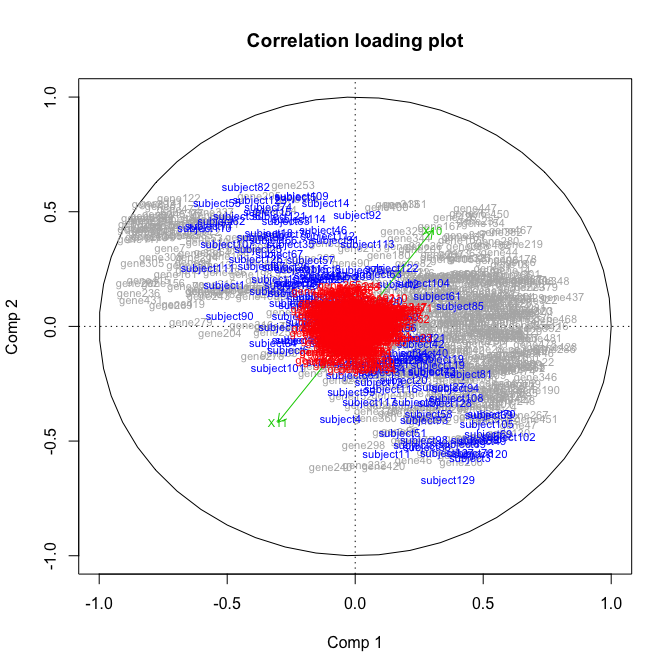

LPLS Regression
================
Solve Sæbø

LPLS - model regression
-----------------------

Based on the NIPALS algorithm this function fits an LPLS - regression model to a dummy - response vector X1 using a predictor matrix X2 with potentially background knowledge matrix X3. This function only supports a single response variable, that is, X1 must be a vector. The fitted model is similar to a regular PLS - model in case X3 is NULL. The matrix X3 typically hold background information about the variables in X2 (e.g. root matrix of some prior covariance matrix, or relevant old data). Based on the size of the parameter alpha, the background information may alter the regular PLS - loading weights in order to make the background information influential on the estimated regression coefficients of the final linear model.

Example
-------

``` r
library(lplsReg)
data(BCdata)
fit.class <- lplsReg(factor(BCdata$Y),  BCdata$X,  BCdata$Z,  npc = 10)
plot(fit.class)
```



``` r
# For regression,  drop the factor() statement and 
# treat the response as a continuous variable.
fit.reg <- lplsReg(BCdata$Y,  BCdata$X,  BCdata$Z,  npc = 10)
```

Installation
------------

You can install this package from github with the help of `devtools` as,

``` r
# devtools::install_github("therimalaya/lplsReg")
library(lplsReg)
```

Documentation
-------------

A very nice documentation with all examples is availiable at,

<https://therimalaya.github.io/lplsReg/index.html>
